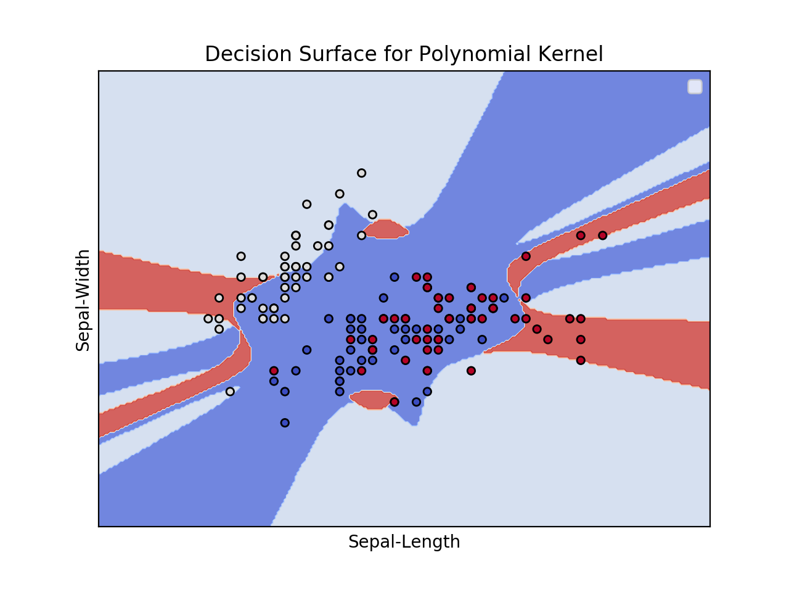
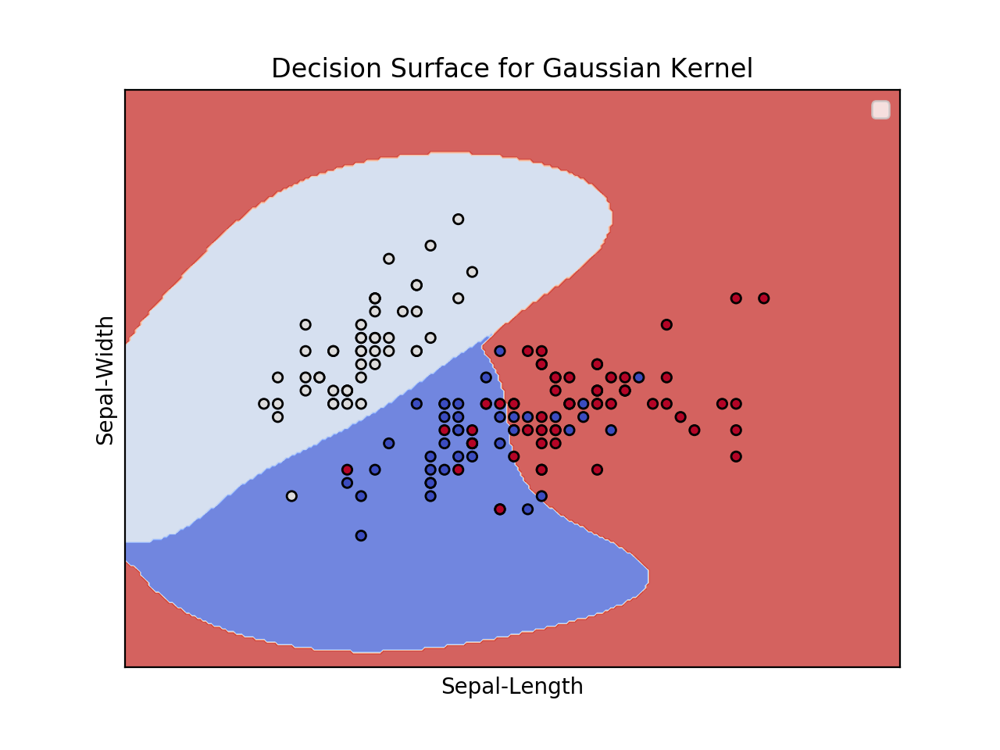
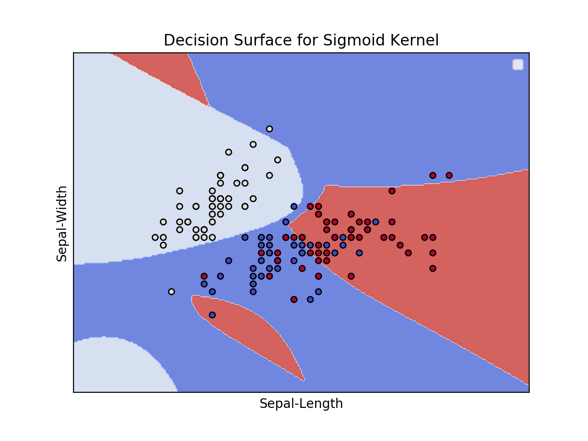

# Lab 7
Contents
```
-Lab7.ipynb
-Lab7.py

-bill_authentication.csv
-gauss.png
-poly.png
-sig.png
```

# Part I
Output for Linear SVM with bill_authentication.csv
```
=====   Linear SVM (Bank authentication) =====
-----   Confusion Matrix   -----
[[138   2]
 [  1 134]]
----- Classification Report -----
              precision    recall  f1-score   support

           0       0.99      0.99      0.99       140
           1       0.99      0.99      0.99       135

   micro avg       0.99      0.99      0.99       275
   macro avg       0.99      0.99      0.99       275
weighted avg       0.99      0.99      0.99       275

```

# Part II
Output for Kernel, Gaussian, Sigmoid Kernels SVMs with Iris Dataset
```
=====   Polynomial Kernel  =====
-----   Confusion Matrix   -----
[[12  0  1]
 [ 0  8  0]
 [ 0  3  6]]
----- Classification Report -----
                 precision    recall  f1-score   support

    Iris-setosa       1.00      0.92      0.96        13
Iris-versicolor       0.73      1.00      0.84         8
 Iris-virginica       0.86      0.67      0.75         9

      micro avg       0.87      0.87      0.87        30
      macro avg       0.86      0.86      0.85        30
   weighted avg       0.88      0.87      0.87        30

=====   Gaussian Kernel  =====
-----   Confusion Matrix   -----
[[13  0  0]
 [ 0  8  0]
 [ 0  1  8]]
----- Classification Report -----
                 precision    recall  f1-score   support

    Iris-setosa       1.00      1.00      1.00        13
Iris-versicolor       0.89      1.00      0.94         8
 Iris-virginica       1.00      0.89      0.94         9

      micro avg       0.97      0.97      0.97        30
      macro avg       0.96      0.96      0.96        30
   weighted avg       0.97      0.97      0.97        30

=====   Sigmoid Kernel  =====
-----   Confusion Matrix   -----
[[13  0  0]
 [ 0  7  1]
 [ 0  1  8]]
----- Classification Report -----
                 precision    recall  f1-score   support

    Iris-setosa       1.00      1.00      1.00        13
Iris-versicolor       0.88      0.88      0.88         8
 Iris-virginica       0.89      0.89      0.89         9

      micro avg       0.93      0.93      0.93        30
      macro avg       0.92      0.92      0.92        30
   weighted avg       0.93      0.93      0.93        30

```

# Part III
Plotting Decision Boundaries with Kernel, Gaussian, Sigmoid Kernels but using Sepal-Width and Sepal-Height

Polynomial Kernel
```
Plotting the three Kernel Models with just 2 features (because 4D plots hard to visualize)
=====   Polynomial Kernel (Sepal-Width + Sepal-Length)  =====
-----   Confusion Matrix   -----
[[8 0 0]
 [8 5 0]
 [8 0 1]]
----- Classification Report -----
              precision    recall  f1-score   support

           1       0.33      1.00      0.50         8
           2       1.00      0.38      0.56        13
           3       1.00      0.11      0.20         9

   micro avg       0.47      0.47      0.47        30
   macro avg       0.78      0.50      0.42        30
weighted avg       0.82      0.47      0.43        30

```


Gaussian Kernel
```
=====   Gaussian Kernel (Sepal-Width + Sepal-Length)  =====
-----   Confusion Matrix   -----
[[10  0  3]
 [ 0  6  0]
 [ 2  0  9]]
----- Classification Report -----
              precision    recall  f1-score   support

           1       0.83      0.77      0.80        13
           2       1.00      1.00      1.00         6
           3       0.75      0.82      0.78        11

   micro avg       0.83      0.83      0.83        30
   macro avg       0.86      0.86      0.86        30
weighted avg       0.84      0.83      0.83        30

```


Sigmoid Kernel
```
====   Sigmoid Kernel (Sepal-Width + Sepal-Length)  =====
-----   Confusion Matrix   -----
[[8 0 5]
 [0 6 0]
 [2 0 9]]
----- Classification Report -----
              precision    recall  f1-score   support

           1       0.80      0.62      0.70        13
           2       1.00      1.00      1.00         6
           3       0.64      0.82      0.72        11

   micro avg       0.77      0.77      0.77        30
   macro avg       0.81      0.81      0.81        30
weighted avg       0.78      0.77      0.77        30

```

